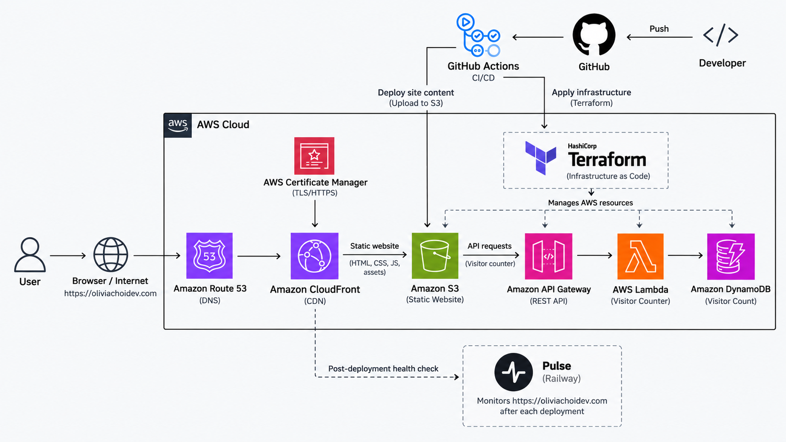

# aws-cloud-resume-challenge

### [oliviachoidev.com](https://oliviachoidev.com)

A serverless cloud portfolio built on AWS with Infrastructure as Code and automated deployment.

⛅️ AWS: S3, Lambda, CloudFront, ACM, Route 53, DynamoDB<br/>
🔁 CI/CD: GitHub Actions<br/>
💻 IaC: Terraform  
🩺 Post-deployment validation: [Pulse](https://github.com/oliviachoiii/pulse) 



## CI/CD Flow

```text
Push to main
→ GitHub Actions
→ Upload website to S3
→ Verify live deployment with Pulse
